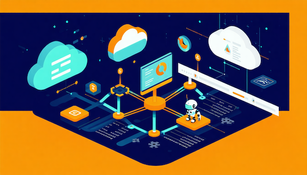

# Track and Optimize Generative AI Spend for Applications, Developers, and Agents on AWS



Sample code for the AWS Workshop: **Track and Optimize Generative AI Spend for Applications, Developers, and Agents on AWS**

**Level:** 300 – Advanced | **Duration:** 3 hours

## Overview

As organizations scale their generative AI workloads on [Amazon Bedrock](https://aws.amazon.com/bedrock/), a common challenge emerges: *who is spending what, and where?* Whether you're running multi-tenant applications, enabling developers with [Claude Code](https://docs.anthropic.com/en/docs/claude-code), or deploying autonomous agents with [Amazon Bedrock AgentCore](https://aws.amazon.com/bedrock/agentcore/), you need visibility into how your AI budget is being consumed.

This workshop provides hands-on experience with five AWS-native cost attribution mechanisms plus LiteLLM as a third-party option. You'll learn to implement each mechanism, combine them for real-world scenarios, and build cost dashboards for operational visibility.

For a detailed introduction to the concepts covered in this workshop, see the companion blog post: [Track and Optimize Generative AI Spend for Applications, Developers, and Agents on AWS](https://builder.aws.com/content/3EtxvhTvYLq48nhi2ClrYaYpQZH/track-and-optimize-generative-ai-spend-for-applications-developers-and-agents-on-aws).

## The Challenge

Generative AI spend is uniquely difficult to track:

- **Token-based pricing** makes costs unpredictable compared to fixed-resource services
- **Shared infrastructure** (one account, many teams) obscures who is driving costs
- **Agentic workloads** (Claude Code, AgentCore) make many inference calls per task with no built-in association between business context and the API call
- **Multi-provider environments** add complexity when teams use Bedrock alongside other model providers

## Cost Attribution Mechanisms Covered

| Mechanism | Endpoint | Visibility Latency | Cost Type | Granularity |
|-----------|----------|-------------------|-----------|-------------|
| IAM Principal Attribution | bedrock-runtime | Up to 24h | Billed dollars | Per identity, per day |
| Application Inference Profiles | bedrock-runtime | Up to 24h | Billed dollars | Per profile, per day |
| Projects | bedrock-mantle | Up to 24h | Billed dollars | Per project, per day |
| Workspaces | bedrock-mantle | Up to 24h | Billed dollars | Per workspace, per day |
| Per-Request Metadata Tagging | bedrock-runtime | Near real-time | Token counts | Per request |
| LiteLLM (third-party) | Proxy layer | Real-time | Estimated cost | Per request |

## Workshop Modules

| Module | Topic | Duration | Description |
|--------|-------|----------|-------------|
| 0 | Environment Setup | 15 min | Deploy CloudFormation stack, verify Bedrock access, explore sample app |
| 1 | IAM Principal Attribution | 30 min | Tag IAM principals, activate cost allocation tags, track per-developer spend |
| 2 | Application Inference Profiles | 30 min | Create tagged profiles, route traffic, compare costs, set budget alerts |
| 3 | Projects & Workspaces | 30 min | Create projects/workspaces for bedrock-mantle workloads (Claude Code) |
| 4 | Per-Request Metadata Tagging | 30 min | Add metadata to API calls, query invocation logs, build usage reports |
| 5 | Combining Methods | 25 min | Multi-layer attribution for agents and developers, join CUR + logs |
| 6 | Dashboards & Alerts | 20 min | QuickSight dashboards, AWS Budgets, Cost Anomaly Detection |

## Repository Structure

```
├── module-0-setup/             # CloudFormation template and setup scripts
├── module-1-iam-attribution/   # IAM tagging and inference call scripts
├── module-2-inference-profiles/# Profile creation and traffic routing
├── module-3-projects-workspaces/ # Project and workspace management
├── module-4-metadata-tagging/  # Per-request metadata and log queries
├── module-5-combining-methods/ # Multi-layer attribution and CUR joins
├── module-6-dashboards-alerts/ # QuickSight, Budgets, and anomaly detection
└── shared/                     # Common utilities and helper functions
```

## Prerequisites

- AWS account with Amazon Bedrock model access enabled
- Basic familiarity with IAM roles and policies
- Basic understanding of Amazon Bedrock APIs (Converse, InvokeModel)
- Python 3.12+ and AWS CLI v2 configured
- AWS CDK or CloudFormation for infrastructure deployment

## Getting Started

1. Clone this repository
2. Follow Module 0 to deploy the workshop infrastructure
3. Work through modules 1–6 sequentially, or jump to any module independently

## Learning Objectives

By the end of this workshop, you will be able to:

1. Explain the cost attribution mechanisms available in Amazon Bedrock and when to use each
2. Configure IAM principal attribution to track per-developer spend (including Claude Code users)
3. Create and tag application inference profiles for per-application cost allocation
4. Set up projects and workspaces for bedrock-mantle workloads
5. Implement per-request metadata tagging for fine-grained per-prompt tracking
6. Attribute costs for Amazon AgentCore agent workloads across tasks and sessions
7. Combine multiple attribution methods for complete cost visibility
8. Build cost dashboards using Cost Explorer, CUR 2.0, and QuickSight

## Target Audience

- Cloud architects and platform engineers responsible for AI cost governance
- FinOps practitioners managing generative AI budgets
- DevOps and ML engineers deploying Bedrock-based applications, Claude Code, or AgentCore agents
- Technical account managers and solutions architects advising on cost optimization

## Security

See [CONTRIBUTING](CONTRIBUTING.md#security-issue-notifications) for more information.

## License

This library is licensed under the MIT-0 License. See the [LICENSE](LICENSE) file.
