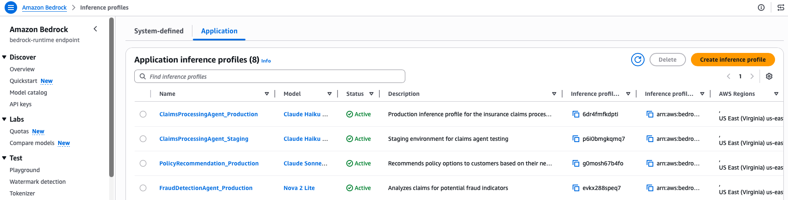

# IAM Principal Attribution

Sample code for tracking per-developer and per-team generative AI spend using IAM principal cost allocation tags.

## Overview

IAM principal attribution is the simplest cost attribution mechanism. By tagging IAM users and roles with cost allocation tags (such as `team` or `cost-center`), you can track spending at the individual or team level without modifying application code.

## Tags Used

| Tag Key | Example Value | Purpose |
|---------|---------------|---------|
| `bedrock:iam-principal:Application` | `CodeAssistant` | Developer productivity tool |
| `bedrock:iam-principal:Environment` | `Development` | Track by environment |
| `bedrock:iam-principal:Team` | `BackendEngineering` | Attribute costs to a team |
| `bedrock:iam-principal:CostCenter` | `ENG-2200` | Map to financial cost center |

These tags use the `bedrock:iam-principal:` prefix and are set on IAM users or roles via `aws iam tag-user` / `aws iam tag-role`. They appear in Cost Explorer and CUR 2.0 once activated as cost allocation tags.

## How It Works

1. Tag IAM users/roles with attributes like `bedrock:iam-principal:Application`, `bedrock:iam-principal:Environment`, `bedrock:iam-principal:Team`, `bedrock:iam-principal:CostCenter`
2. Make inference calls as the tagged principals
3. After ~24 hours, the tags become available for activation in AWS Billing > Cost Allocation Tags
4. Activate the cost allocation tags
5. Make additional inference calls as the tagged principals
6. After ~24 hours, costs appear in Cost Explorer and CUR 2.0, grouped by your tags

## Best For

- Per-developer visibility (including Claude Code users whose sessions map to IAM roles)
- Team-level cost tracking with zero code changes

## Prerequisites

- Python 3.12+
- IAM credentials with permissions for `iam:TagUser`, `iam:TagRole`, `iam:ListUserTags`, `iam:ListRoleTags`, and `bedrock-runtime:Converse`
- Access to Claude or Nova models on Amazon Bedrock
- Dependencies installed via `pip install -r requirements.txt` from the repository root

## Viewing Your IAM Roles

After running the sample, you can see the created IAM roles and their tags in the IAM console:

