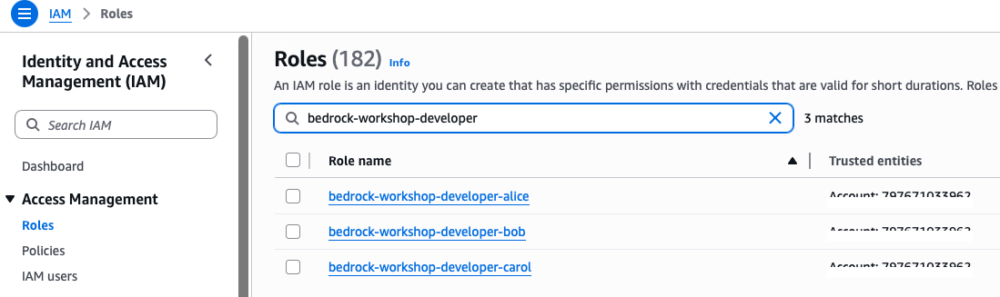
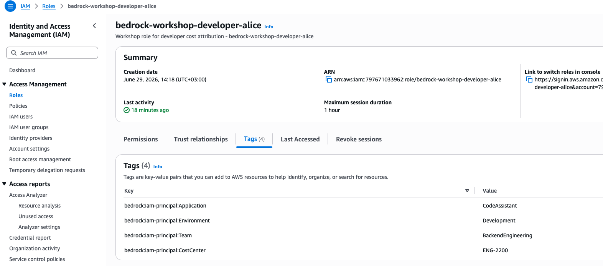
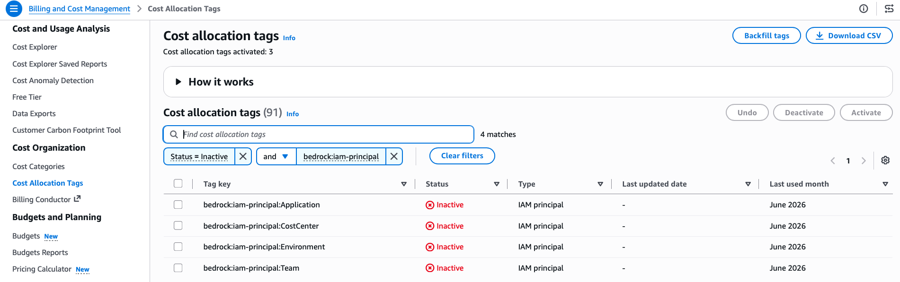
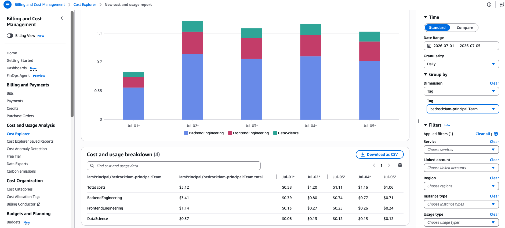
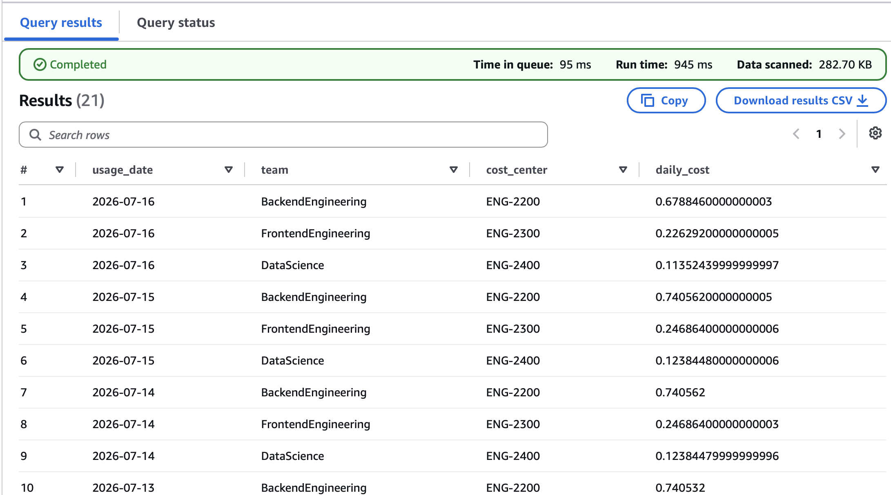
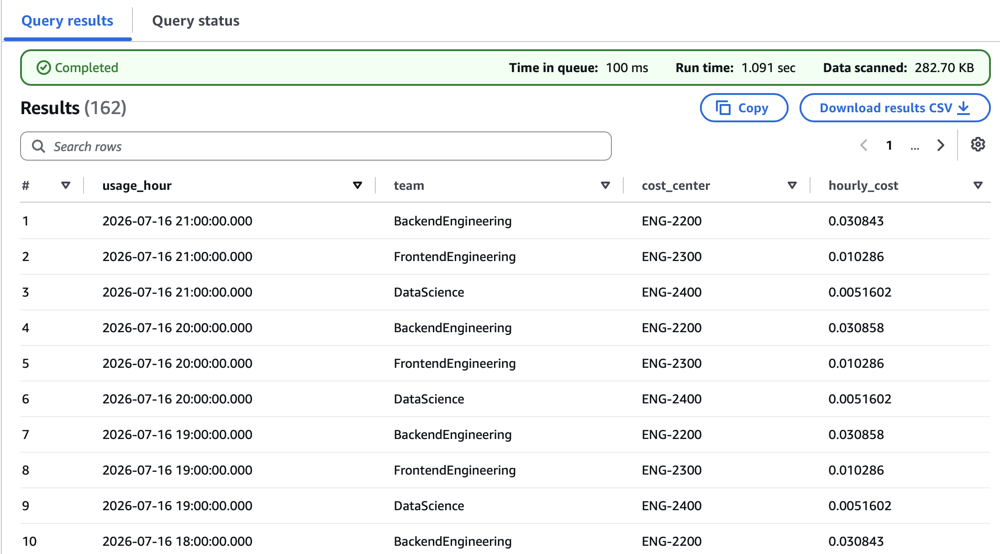

# IAM Principal Attribution

Sample code for tracking per-developer and per-team generative AI spend using IAM principal cost allocation tags.

## Overview

IAM principal attribution is the simplest cost attribution mechanism. By tagging IAM users and roles with cost allocation tags (such as `team` or `cost-center`), you can track spending at the individual or team level without modifying application code.

## Tags Used

| Tag Key | Example Value | Purpose |
|---------|---------------|---------|
| `bedrock:iam-principal:Application` | `CodeAssistant` | Developer productivity tool |
| `bedrock:iam-principal:Environment` | `Development` | Track by environment |
| `bedrock:iam-principal:Team` | `BackendEngineering` | Attribute costs to a team |
| `bedrock:iam-principal:CostCenter` | `ENG-2200` | Map to financial cost center |

These tags use the `bedrock:iam-principal:` prefix and are set on IAM users or roles via `aws iam tag-user` / `aws iam tag-role`. They appear in Cost Explorer and CUR 2.0 once activated as cost allocation tags.

## How It Works

1. Tag IAM users/roles with attributes like `bedrock:iam-principal:Application`, `bedrock:iam-principal:Environment`, `bedrock:iam-principal:Team`, `bedrock:iam-principal:CostCenter`
2. Make inference calls as the tagged principals
3. After ~24 hours, the tags become available for activation in AWS Billing > Cost Allocation Tags
4. Activate the cost allocation tags
5. Make additional inference calls as the tagged principals
6. After ~24 hours, costs appear in Cost Explorer and CUR 2.0, grouped by your tags

## Best For

- Per-developer visibility (including Claude Code users whose sessions map to IAM roles)
- Team-level cost tracking with zero code changes

## Scripts

| Script | Description |
|--------|-------------|
| `1-1_setup_iam_roles.py` | Creates IAM roles for each developer, attaches Bedrock invoke permissions, and tags them with cost allocation attributes |
| `1-2_invoke_models.py` | Assumes each developer role and makes Bedrock Converse API calls attributed to the role's tags |

Run them in order:

```bash
python 1-1_setup_iam_roles.py   # Create & tag roles (waits for IAM propagation)
python 1-2_invoke_models.py     # Invoke models as different developers
```

## Prerequisites

- Python 3.12+
- IAM credentials with permissions for `iam:TagRole`, `iam:CreateRole`, `iam:PutRolePolicy`, `iam:ListRoleTags`, `sts:AssumeRole`, and `bedrock-runtime:Converse`
- Access to Claude or Nova models on Amazon Bedrock
- Dependencies installed via `pip install -r requirements.txt` from the repository root

## Viewing Your IAM Roles

After running the sample, you can see the created IAM roles and their tags in the IAM console:



Here's an example of the tags applied to a developer role (`bedrock-workshop-developer-alice`):



## Activating Cost Allocation Tags

After ~24 hours from making inference calls, the tags will appear as **inactive** in AWS Billing > Cost Allocation Tags. You need to activate them to start seeing costs grouped by these tags in Cost Explorer.



## Viewing Costs in Cost Explorer

After enabling cost allocation tags and continuing to invoke Bedrock models by running this sample code, wait ~24 hours for billing data to populate. You can then browse to Cost Explorer and see the spend per team:



## Querying Costs with Athena (CUR 2.0 Data Exports)

For deeper analysis beyond what Cost Explorer provides, you can query your cost data directly using Amazon Athena with [AWS Data Exports](https://docs.aws.amazon.com/cur/latest/userguide/what-is-data-exports.html). Data Exports delivers CUR 2.0 data to S3, where Athena can query it using standard SQL.

This gives you full flexibility to slice costs by any tag combination, aggregate at any time granularity, and join with other datasets.

### Prerequisites

- A CUR 2.0 Data Export configured to deliver to S3 (see [Creating Data Exports](https://docs.aws.amazon.com/cur/latest/userguide/what-is-data-exports.html))
- An Athena table created on top of the exported data (the examples below use `"my-cur-data-1"."data"`)
- IAM principal cost allocation tags activated (from the previous steps)

### Query 1: Daily costs by team (last 7 days)

```sql
-- Daily costs by team (IAM principal attribution) - last 7 days
SELECT
    DATE(line_item_usage_start_date) AS usage_date,
    element_at(tags, 'iamPrincipal/bedrock:iam-principal:Team') AS team,
    element_at(tags, 'iamPrincipal/bedrock:iam-principal:CostCenter') AS cost_center,
    SUM(line_item_unblended_cost) AS daily_cost
FROM "my-cur-data-1"."data"
WHERE element_at(tags, 'iamPrincipal/bedrock:iam-principal:Team') IS NOT NULL
  AND line_item_usage_start_date >= current_date - interval '7' day
GROUP BY 1, 2, 3
ORDER BY usage_date DESC, daily_cost DESC;
```



### Query 2: Hourly costs by team (last 72 hours)

For finer-grained visibility, you can drill down to hourly cost breakdowns:

```sql
-- Hourly costs by team (IAM principal attribution) - last 72 hours
SELECT
    date_trunc('hour', line_item_usage_start_date) AS usage_hour,
    element_at(tags, 'iamPrincipal/bedrock:iam-principal:Team') AS team,
    element_at(tags, 'iamPrincipal/bedrock:iam-principal:CostCenter') AS cost_center,
    SUM(line_item_unblended_cost) AS hourly_cost
FROM "my-cur-data-1"."data"
WHERE element_at(tags, 'iamPrincipal/bedrock:iam-principal:Team') IS NOT NULL
  AND line_item_usage_start_date >= current_timestamp - interval '72' hour
GROUP BY 1, 2, 3
ORDER BY usage_hour DESC, hourly_cost DESC;
```


