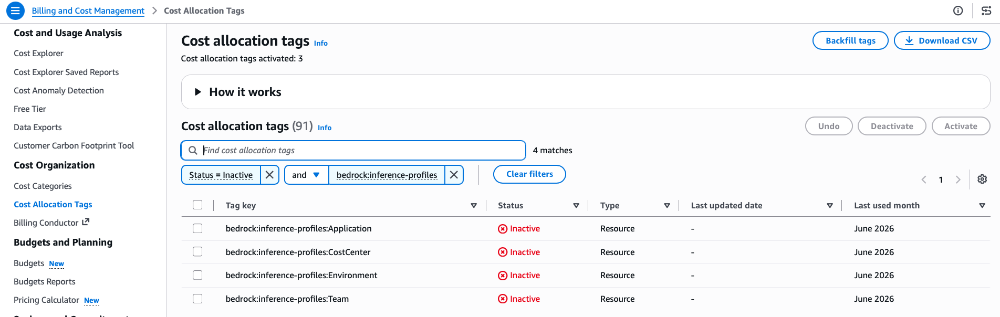

# Application Inference Profiles

Sample code for creating tagged inference profiles and routing application traffic through them for per-application cost visibility.

## Overview

Application inference profiles let you create named, tagged endpoints that wrap on-demand models. By routing traffic through profiles, the resource tags flow directly to your billing tools, giving you per-application cost visibility in Cost Explorer and CUR 2.0.

## Tags Used

| Tag Key | Example Value | Purpose |
|---------|---------------|---------|
| `bedrock:inference-profiles:Application` | `ClaimsProcessingAgent` | Insurance claims automation |
| `bedrock:inference-profiles:Environment` | `Production` | Track by environment |
| `bedrock:inference-profiles:Team` | `InsurancePlatform` | Attribute costs to a team |
| `bedrock:inference-profiles:CostCenter` | `INS-4400` | Map to financial cost center |

These tags use the `bedrock:inference-profiles:` prefix and are applied to the inference profile resource via `aws bedrock tag-resource`. They appear in Cost Explorer and CUR 2.0 once activated as cost allocation tags.

## How It Works

1. Create an application inference profile wrapping a foundation model
2. Tag the profile with attributes like `bedrock:inference-profiles:Application`, `bedrock:inference-profiles:Environment`, `bedrock:inference-profiles:Team`, `bedrock:inference-profiles:CostCenter`
3. Route inference calls through the profile (using the profile ARN instead of the model ID)
4. After ~24 hours, the tags become available for activation in AWS Billing > Cost Allocation Tags
5. Activate the cost allocation tags
6. Make additional inference calls through the profile
7. After ~24 hours, costs appear in Cost Explorer and CUR 2.0, grouped by profile tags

## Best For

- Per-application or per-team cost isolation on `bedrock-runtime` workloads
- Multiple applications sharing a single AWS account

## Scripts

| Script | Description |
|--------|-------------|
| `2-1_setup_inference_profiles.py` | Creates application inference profiles, tags them with cost allocation attributes, and verifies tags |
| `2-2_invoke_models.py` | Invokes Bedrock models through the profiles (single call, multi-step agent, multiple profiles) |

Run them in order:

```bash
python 2-1_setup_inference_profiles.py   # Create & tag profiles
python 2-2_invoke_models.py              # Invoke models through profiles
```

## Prerequisites

- Python 3.12+
- IAM credentials with permissions for `bedrock:CreateInferenceProfile`, `bedrock:TagResource`, and `bedrock-runtime:Converse`
- Access to Claude models on Amazon Bedrock
- Dependencies installed via `pip install -r requirements.txt` from the repository root

## Viewing Your Inference Profiles

After running the sample, you can see the created inference profiles in the Bedrock console:


## Activating Cost Allocation Tags

After ~24 hours from making inference calls through the profiles, the tags will appear as **inactive** in AWS Billing > Cost Allocation Tags. You need to activate them to start seeing costs grouped by these tags in Cost Explorer.


