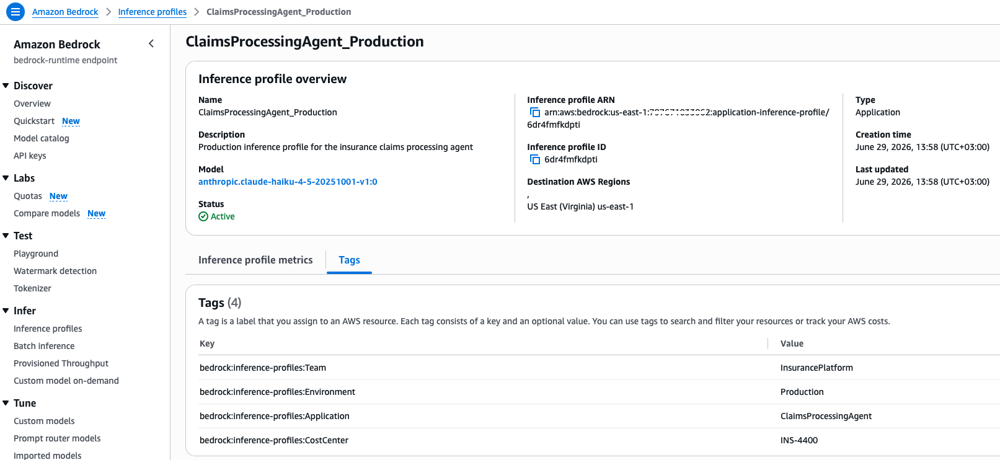
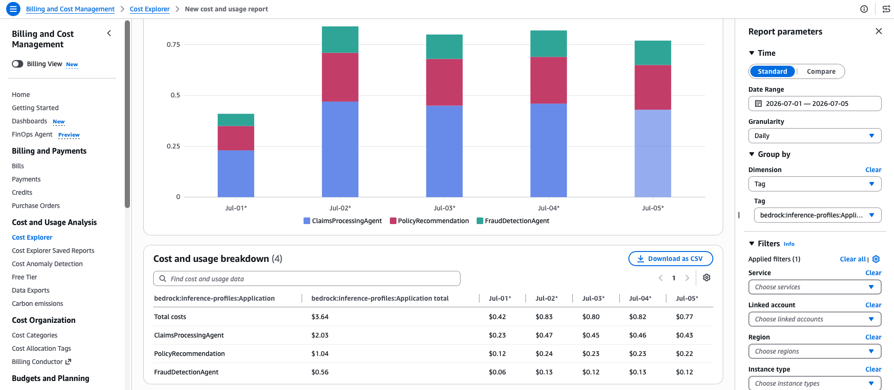
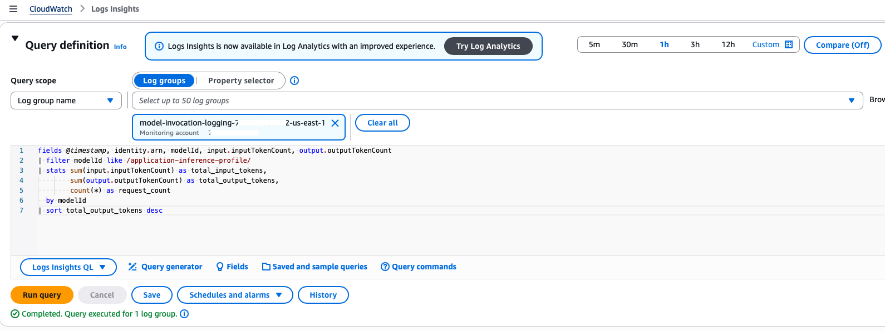
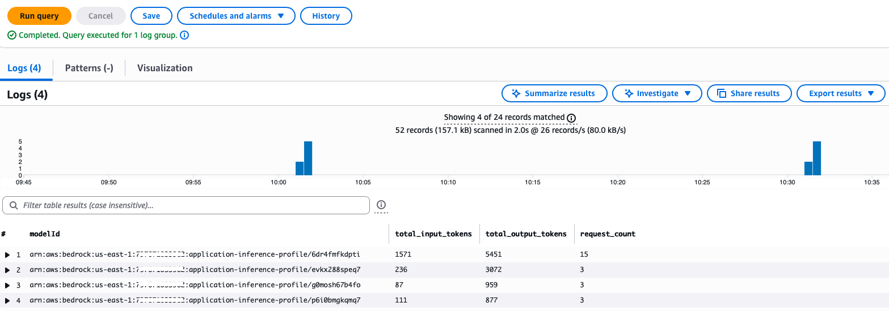
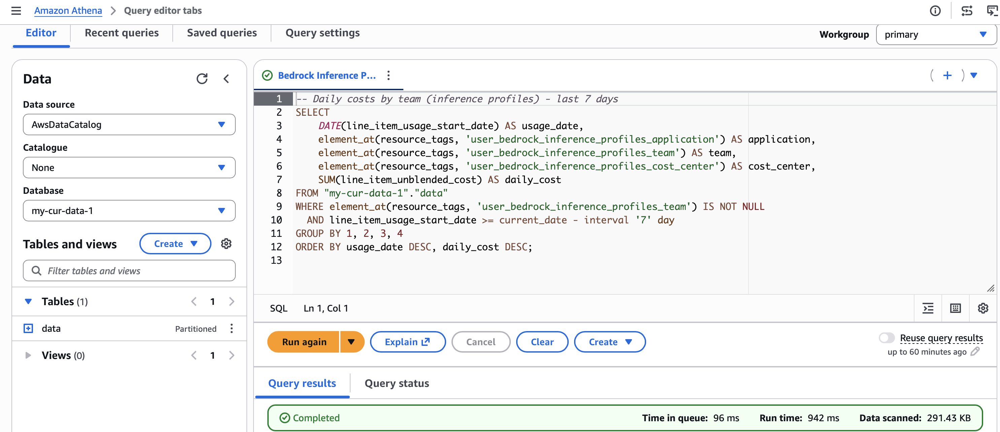
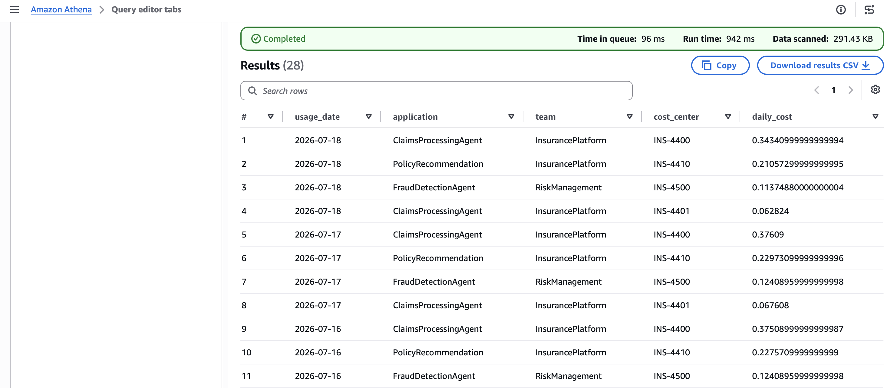
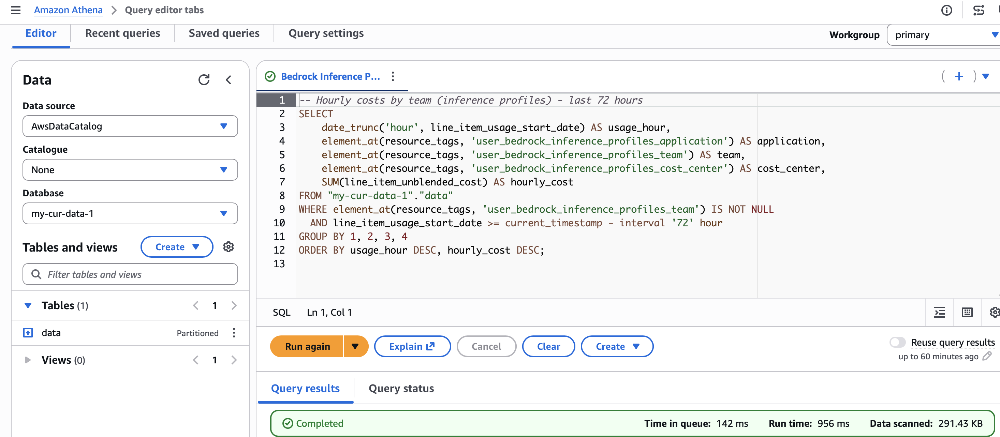
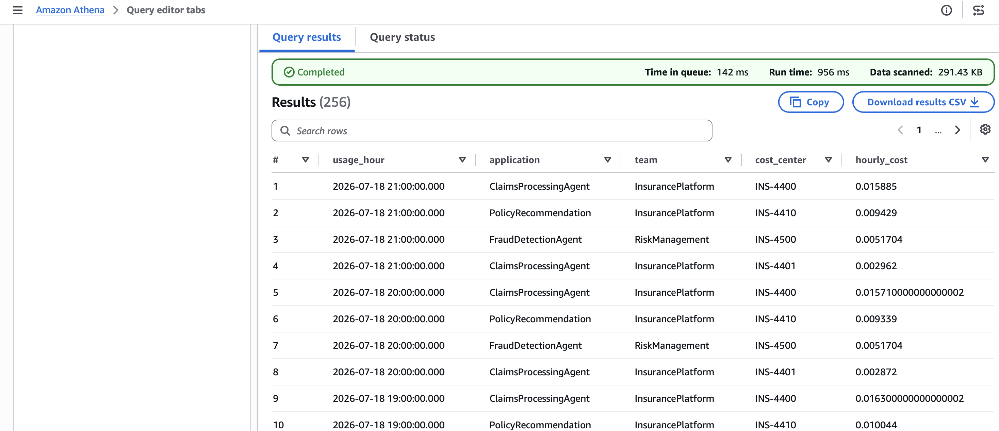

# Application Inference Profiles

Sample code for creating tagged inference profiles and routing application traffic through them for per-application cost visibility.

## Overview

Application inference profiles let you create named, tagged endpoints that wrap on-demand models. By routing traffic through profiles, the resource tags flow directly to your billing tools, giving you per-application cost visibility in Cost Explorer and CUR 2.0.

## Tags Used

| Tag Key | Example Value | Purpose |
|---------|---------------|---------|
| `bedrock:inference-profiles:Application` | `ClaimsProcessingAgent` | Insurance claims automation |
| `bedrock:inference-profiles:Environment` | `Production` | Track by environment |
| `bedrock:inference-profiles:Team` | `InsurancePlatform` | Attribute costs to a team |
| `bedrock:inference-profiles:CostCenter` | `INS-4400` | Map to financial cost center |

These tags use the `bedrock:inference-profiles:` prefix and are applied to the inference profile resource via `aws bedrock tag-resource`. They appear in Cost Explorer and CUR 2.0 once activated as cost allocation tags.

## How It Works

1. Create an application inference profile wrapping a foundation model
2. Tag the profile with attributes like `bedrock:inference-profiles:Application`, `bedrock:inference-profiles:Environment`, `bedrock:inference-profiles:Team`, `bedrock:inference-profiles:CostCenter`
3. Route inference calls through the profile (using the profile ARN instead of the model ID)
4. After ~24 hours, the tags become available for activation in AWS Billing > Cost Allocation Tags
5. Activate the cost allocation tags
6. Make additional inference calls through the profile
7. After ~24 hours, costs appear in Cost Explorer and CUR 2.0, grouped by profile tags

## Best For

- Per-application or per-team cost isolation on `bedrock-runtime` workloads
- Multiple applications sharing a single AWS account

## Scripts

| Script | Description |
|--------|-------------|
| `2-1_setup_inference_profiles.py` | Creates application inference profiles, tags them with cost allocation attributes, and verifies tags |
| `2-2_invoke_models.py` | Invokes Bedrock models through the profiles (single call, multi-step agent, multiple profiles) |

Run them in order:

```bash
python 2-1_setup_inference_profiles.py   # Create & tag profiles
python 2-2_invoke_models.py              # Invoke models through profiles
```

## Prerequisites

- Python 3.12+
- IAM credentials with permissions for `bedrock:CreateInferenceProfile`, `bedrock:TagResource`, and `bedrock-runtime:Converse`
- Access to Claude models on Amazon Bedrock
- Dependencies installed via `pip install -r requirements.txt` from the repository root

## Viewing Your Inference Profiles

After running the sample, you can see the created inference profiles in the Bedrock console:


Here's an example of the tags applied to an inference profile (`ClaimsProcessingAgent_Production`):



## Activating Cost Allocation Tags

After ~24 hours from making inference calls through the profiles, the tags will appear as **inactive** in AWS Billing > Cost Allocation Tags. You need to activate them to start seeing costs grouped by these tags in Cost Explorer.


## Viewing Costs in Cost Explorer

After enabling cost allocation tags and continuing to invoke Bedrock models through inference profiles by running this sample code, wait ~24 hours for billing data to populate. You can then browse to Cost Explorer and see the spend per application:



## Near Real-Time Visibility with CloudWatch Logs Insights

While Cost Explorer and CUR provide billed-dollar visibility with a ~24 hour delay, you can get **near real-time token usage** per inference profile by querying model invocation logs in CloudWatch Logs Insights. When you invoke through a profile, the profile ARN appears as the `modelId` in the logs.

Example query to see token usage by inference profile:

```
fields @timestamp, identity.arn, modelId, input.inputTokenCount, output.outputTokenCount
| filter modelId like /application-inference-profile/
| stats sum(input.inputTokenCount) as total_input_tokens,
        sum(output.outputTokenCount) as total_output_tokens,
        count(*) as request_count
  by modelId
| sort total_output_tokens desc
```






## Querying Costs with Athena (CUR 2.0 Data Exports)

For deeper analysis beyond what Cost Explorer provides, you can query your cost data directly using Amazon Athena with [AWS Data Exports](https://docs.aws.amazon.com/cur/latest/userguide/what-is-data-exports.html). Data Exports delivers CUR 2.0 data to S3, where Athena can query it using standard SQL.

This gives you full flexibility to slice costs by any tag combination, aggregate at any time granularity, and join with other datasets.

### Prerequisites

- A CUR 2.0 Data Export configured to deliver to S3 (see [Creating Data Exports](https://docs.aws.amazon.com/cur/latest/userguide/what-is-data-exports.html))
- An Athena table created on top of the exported data (the examples below use `"my-cur-data-1"."data"`)
- Inference profile cost allocation tags activated (from the previous steps)

### Navigating to Athena

1. Open the [AWS Management Console](https://console.aws.amazon.com/)
2. In the search bar at the top, type **Athena** and select **Amazon Athena**
3. If this is your first time, click **Explore the query editor** to open the Athena Query Editor
4. In the left panel, select your **Data source** (usually `AwsDataCatalog`) and the **Database** that corresponds to your CUR 2.0 Data Export (e.g., `my-cur-data-1`)
5. Paste your SQL query in the query editor and click **Run**

### Query 1: Daily costs by team (last 7 days)

```sql
-- Daily costs by team (inference profiles) - last 7 days
SELECT
    DATE(line_item_usage_start_date) AS usage_date,
    element_at(resource_tags, 'user_bedrock_inference_profiles_application') AS application,
    element_at(resource_tags, 'user_bedrock_inference_profiles_team') AS team,
    element_at(resource_tags, 'user_bedrock_inference_profiles_cost_center') AS cost_center,
    SUM(line_item_unblended_cost) AS daily_cost
FROM "my-cur-data-1"."data"
WHERE element_at(resource_tags, 'user_bedrock_inference_profiles_team') IS NOT NULL
  AND line_item_usage_start_date >= current_date - interval '7' day
GROUP BY 1, 2, 3, 4
ORDER BY usage_date DESC, daily_cost DESC;
```





### Query 2: Hourly costs by team (last 72 hours)

For finer-grained visibility, you can drill down to hourly cost breakdowns:

```sql
-- Hourly costs by team (inference profiles) - last 72 hours
SELECT
    date_trunc('hour', line_item_usage_start_date) AS usage_hour,
    element_at(resource_tags, 'user_bedrock_inference_profiles_application') AS application,
    element_at(resource_tags, 'user_bedrock_inference_profiles_team') AS team,
    element_at(resource_tags, 'user_bedrock_inference_profiles_cost_center') AS cost_center,
    SUM(line_item_unblended_cost) AS hourly_cost
FROM "my-cur-data-1"."data"
WHERE element_at(resource_tags, 'user_bedrock_inference_profiles_team') IS NOT NULL
  AND line_item_usage_start_date >= current_timestamp - interval '72' hour
GROUP BY 1, 2, 3, 4
ORDER BY usage_hour DESC, hourly_cost DESC;
```




