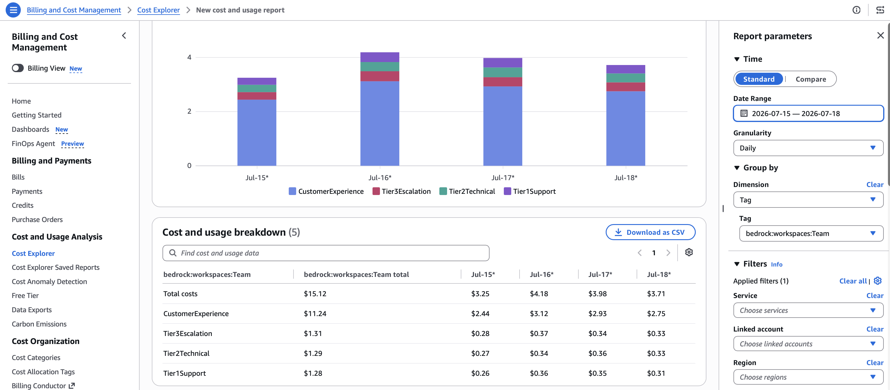
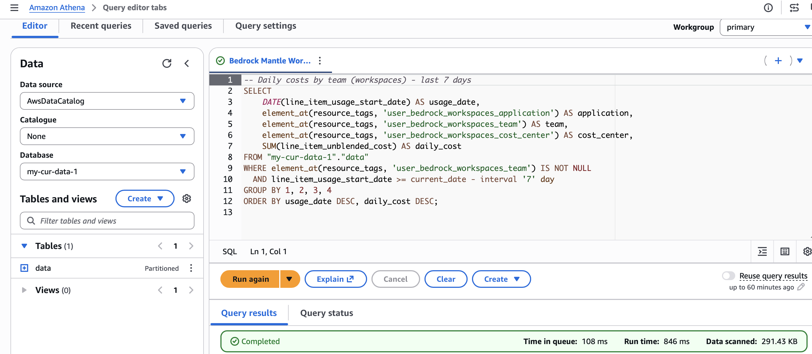
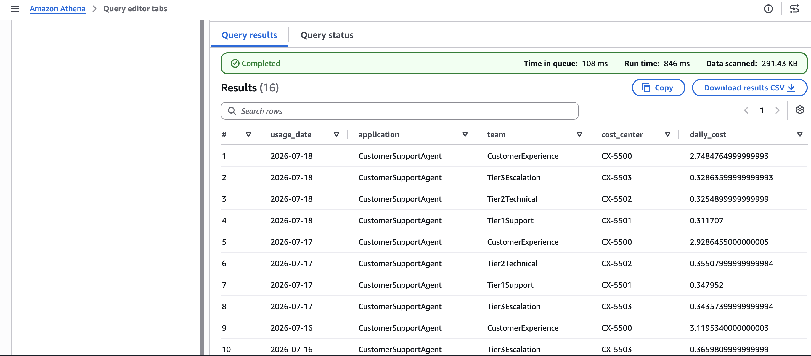
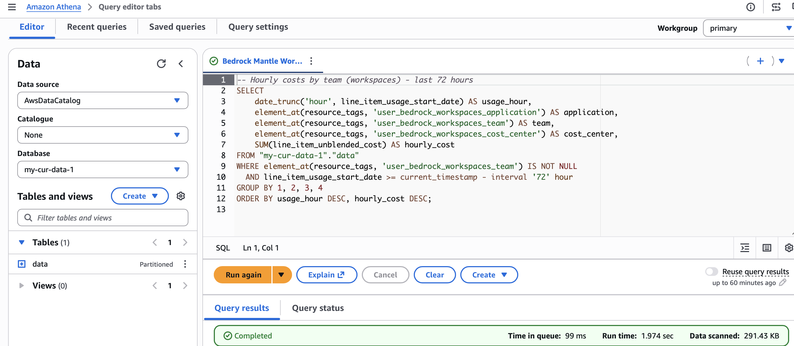
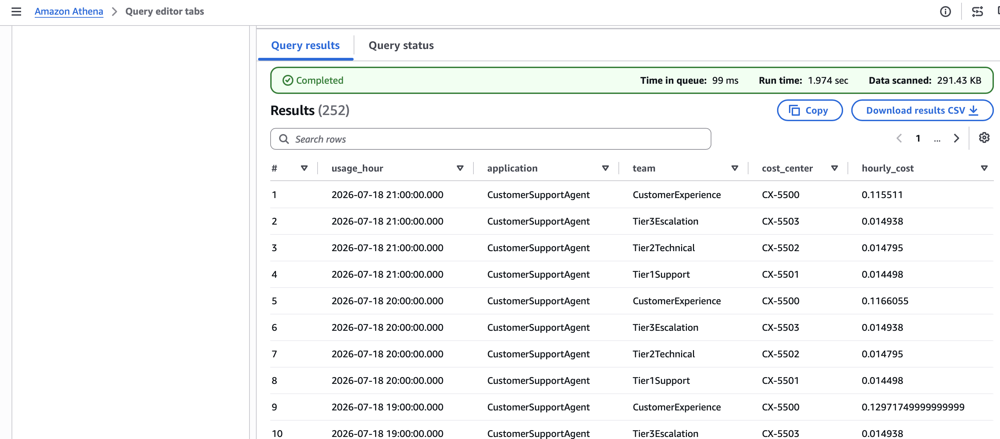

# Workspaces

Sample code for creating workspaces and using the `anthropic-workspace-id` header for cost attribution on the Anthropic Messages API.

## Overview

Workspaces provide cost attribution for the Anthropic-compatible Messages API on the `bedrock-mantle` endpoint. By setting the `anthropic-workspace-id` HTTP header on each request, tags applied to the workspace appear in your billing tools.

## Tags Used

| Tag Key | Example Value | Purpose |
|---------|---------------|---------|
| `bedrock:workspaces:Application` | `CustomerSupportAgent` | Multi-turn support automation |
| `bedrock:workspaces:Environment` | `Production` | Track by environment |
| `bedrock:workspaces:Team` | `CustomerExperience` | Attribute costs to a team |
| `bedrock:workspaces:CostCenter` | `CX-5500` | Map to financial cost center |

These tags use the `bedrock:workspaces:` prefix and are set when creating or updating the workspace. They appear in Cost Explorer and CUR 2.0 once activated as cost allocation tags.

## How It Works

1. Create a workspace in Amazon Bedrock
2. Tag the workspace with attributes like `bedrock:workspaces:Application`, `bedrock:workspaces:Environment`, `bedrock:workspaces:Team`, `bedrock:workspaces:CostCenter`
3. Make inference calls using the `anthropic-workspace-id` header in your Anthropic SDK requests
4. After ~24 hours, the tags become available for activation in AWS Billing > Cost Allocation Tags
5. Activate the cost allocation tags
6. Make additional inference calls through the workspace
7. After ~24 hours, costs appear in Cost Explorer and CUR 2.0, grouped by workspace tags

## Best For

- Anthropic SDK-based applications that need per-app cost segmentation
- Claude Code cost tracking when using the Mantle endpoint (`CLAUDE_CODE_USE_MANTLE=1`)

## Scripts

| Script | Description |
|--------|-------------|
| `3-1_setup_workspaces.py` | Creates workspaces with cost allocation tags for different support tiers |
| `3-2_invoke_models.py` | Invokes models through workspaces (Anthropic SDK, HTTP, multi-turn conversation) |

Run them in order:

```bash
python 3-1_setup_workspaces.py   # Create & tag workspaces
python 3-2_invoke_models.py      # Invoke models through workspaces
```

## Prerequisites

- Python 3.12+
- A Bedrock API key ([create one here](https://docs.aws.amazon.com/bedrock/latest/userguide/api-keys.html))
- Access to Claude models on Amazon Bedrock
- Dependencies installed via `pip install -r requirements.txt` from the repository root

## Viewing Your Workspaces

After running the sample, you can see the created workspaces in the Bedrock console. Filter by **Status = Active** to view the workspaces and their associated tags:


## Activating Cost Allocation Tags

After ~24 hours from making inference calls through the workspaces, the tags will appear as **inactive** in AWS Billing > Cost Allocation Tags. You need to activate them to start seeing costs grouped by these tags in Cost Explorer.


## Viewing Costs in Cost Explorer

After activating cost allocation tags and continuing to invoke models through workspaces, wait ~24 hours for billing data to populate. You can then view costs grouped by workspace team in Cost Explorer:

1. Open **Billing and Cost Management** > **Cost Explorer**
2. Set the **Granularity** to **Daily**
3. Under **Group by**, set **Dimension** to **Tag**
4. Select the tag `bedrock:workspaces:Team`
5. Optionally filter by **Service** to scope results to Bedrock

You'll see a breakdown of daily costs per team (e.g., CustomerExperience, Tier3Escalation, Tier2Technical, Tier1Support):



## Querying Costs with Athena (CUR 2.0 Data Exports)

For deeper analysis beyond what Cost Explorer provides, you can query your cost data directly using Amazon Athena with [AWS Data Exports](https://docs.aws.amazon.com/cur/latest/userguide/what-is-data-exports.html). Data Exports delivers CUR 2.0 data to S3, where Athena can query it using standard SQL.

This gives you full flexibility to slice costs by any tag combination, aggregate at any time granularity, and join with other datasets.

### Prerequisites

- A CUR 2.0 Data Export configured to deliver to S3 (see [Creating Data Exports](https://docs.aws.amazon.com/cur/latest/userguide/what-is-data-exports.html))
- An Athena table created on top of the exported data (the examples below use `"my-cur-data-1"."data"`)
- Workspace cost allocation tags activated (from the previous steps)

### Navigating to Athena

1. Open the [AWS Management Console](https://console.aws.amazon.com/)
2. In the search bar at the top, type **Athena** and select **Amazon Athena**
3. If this is your first time, click **Explore the query editor** to open the Athena Query Editor
4. In the left panel, select your **Data source** (usually `AwsDataCatalog`) and the **Database** that corresponds to your CUR 2.0 Data Export (e.g., `my-cur-data-1`)
5. Paste your SQL query in the query editor and click **Run**

### Query 1: Daily costs by team (last 7 days)

```sql
-- Daily costs by team (workspaces) - last 7 days
SELECT
    DATE(line_item_usage_start_date) AS usage_date,
    element_at(resource_tags, 'user_bedrock_workspaces_application') AS application,
    element_at(resource_tags, 'user_bedrock_workspaces_team') AS team,
    element_at(resource_tags, 'user_bedrock_workspaces_cost_center') AS cost_center,
    SUM(line_item_unblended_cost) AS daily_cost
FROM "my-cur-data-1"."data"
WHERE element_at(resource_tags, 'user_bedrock_workspaces_team') IS NOT NULL
  AND line_item_usage_start_date >= current_date - interval '7' day
GROUP BY 1, 2, 3, 4
ORDER BY usage_date DESC, daily_cost DESC;
```





### Query 2: Hourly costs by team (last 72 hours)

For finer-grained visibility, you can drill down to hourly cost breakdowns:

```sql
-- Hourly costs by team (workspaces) - last 72 hours
SELECT
    date_trunc('hour', line_item_usage_start_date) AS usage_hour,
    element_at(resource_tags, 'user_bedrock_workspaces_application') AS application,
    element_at(resource_tags, 'user_bedrock_workspaces_team') AS team,
    element_at(resource_tags, 'user_bedrock_workspaces_cost_center') AS cost_center,
    SUM(line_item_unblended_cost) AS hourly_cost
FROM "my-cur-data-1"."data"
WHERE element_at(resource_tags, 'user_bedrock_workspaces_team') IS NOT NULL
  AND line_item_usage_start_date >= current_timestamp - interval '72' hour
GROUP BY 1, 2, 3, 4
ORDER BY usage_hour DESC, hourly_cost DESC;
```




