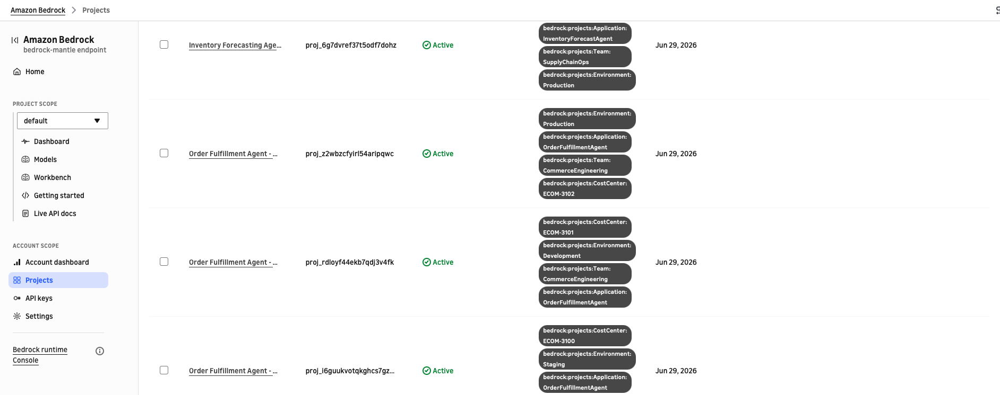
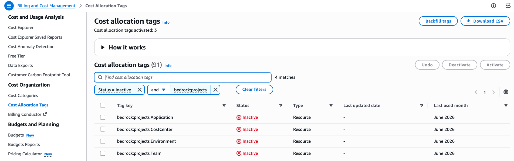

# Projects

Sample code for creating and tagging projects for cost attribution on the `bedrock-mantle` endpoint (OpenAI-compatible Responses API).

## Overview

Projects provide resource-level tagging for workloads using the OpenAI-compatible Responses API on the `bedrock-mantle` endpoint. Tags applied to projects flow to Cost Explorer and CUR 2.0.

## Tags Used

| Tag Key | Example Value | Purpose |
|---------|---------------|---------|
| `bedrock:projects:Application` | `OrderFulfillmentAgent` | E-commerce order orchestration |
| `bedrock:projects:Environment` | `Staging` | Track by environment |
| `bedrock:projects:Team` | `CommerceEngineering` | Attribute costs to a team |
| `bedrock:projects:CostCenter` | `ECOM-3100` | Map to financial cost center |

These tags use the `bedrock:projects:` prefix and are set when creating or updating the project. They appear in Cost Explorer and CUR 2.0 once activated as cost allocation tags.

## How It Works

1. Create a project in Amazon Bedrock
2. Tag the project with attributes like `bedrock:projects:Application`, `bedrock:projects:Environment`, `bedrock:projects:Team`, `bedrock:projects:CostCenter`
3. Route OpenAI-compatible Responses API calls through the project
4. After ~24 hours, the tags become available for activation in AWS Billing > Cost Allocation Tags
5. Activate the cost allocation tags
6. Make additional API calls through the project
7. After ~24 hours, costs appear in Cost Explorer and CUR 2.0, grouped by project tags

## Best For

- Teams using the OpenAI SDK through the bedrock-mantle endpoint
- Applications built on the OpenAI-compatible Responses API

## Scripts

| Script | Description |
|--------|-------------|
| `4-1_setup_projects.py` | Creates projects with cost allocation tags for multiple environments |
| `4-2_invoke_models.py` | Invokes models through projects (OpenAI SDK, HTTP, multi-step agent) |

Run them in order:

```bash
python 4-1_setup_projects.py   # Create & tag projects
python 4-2_invoke_models.py    # Invoke models through projects
```

## Prerequisites

- Python 3.12+
- A Bedrock API key ([create one here](https://docs.aws.amazon.com/bedrock/latest/userguide/api-keys.html)) or IAM credentials for bearer token generation
- Access to OpenAI models (GPT-5.5) on Amazon Bedrock
- Dependencies installed via `pip install -r requirements.txt` from the repository root

## Viewing Your Projects

After running the sample, you can see the created projects in the Bedrock console. Filter by **Status = Active** to view the projects and their associated tags:



## Activating Cost Allocation Tags

After ~24 hours from making inference calls through the projects, the tags will appear as **inactive** in AWS Billing > Cost Allocation Tags. You need to activate them to start seeing costs grouped by these tags in Cost Explorer.


