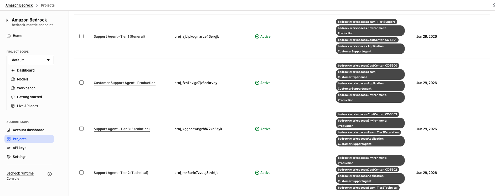
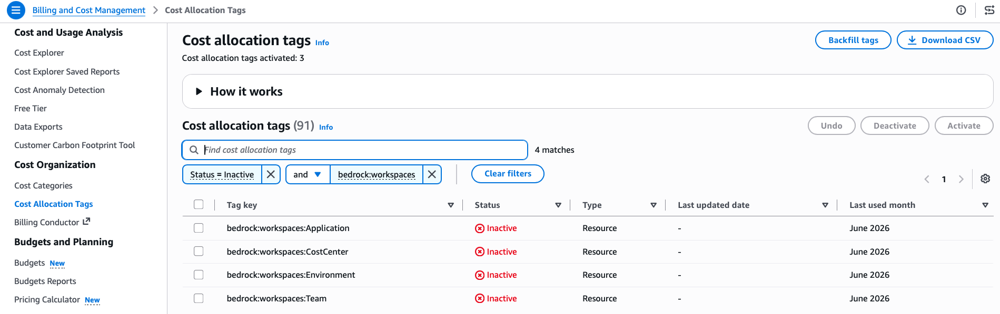

# Workspaces

Sample code for creating workspaces and using the `anthropic-workspace-id` header for cost attribution on the Anthropic Messages API.

## Overview

Workspaces provide cost attribution for the Anthropic-compatible Messages API on the `bedrock-mantle` endpoint. By setting the `anthropic-workspace-id` HTTP header on each request, tags applied to the workspace appear in your billing tools.

## Tags Used

| Tag Key | Example Value | Purpose |
|---------|---------------|---------|
| `bedrock:workspaces:Application` | `CustomerSupportAgent` | Multi-turn support automation |
| `bedrock:workspaces:Environment` | `Production` | Track by environment |
| `bedrock:workspaces:Team` | `CustomerExperience` | Attribute costs to a team |
| `bedrock:workspaces:CostCenter` | `CX-5500` | Map to financial cost center |

These tags use the `bedrock:workspaces:` prefix and are set when creating or updating the workspace. They appear in Cost Explorer and CUR 2.0 once activated as cost allocation tags.

## How It Works

1. Create a workspace in Amazon Bedrock
2. Tag the workspace with attributes like `bedrock:workspaces:Application`, `bedrock:workspaces:Environment`, `bedrock:workspaces:Team`, `bedrock:workspaces:CostCenter`
3. Make inference calls using the `anthropic-workspace-id` header in your Anthropic SDK requests
4. After ~24 hours, the tags become available for activation in AWS Billing > Cost Allocation Tags
5. Activate the cost allocation tags
6. Make additional inference calls through the workspace
7. After ~24 hours, costs appear in Cost Explorer and CUR 2.0, grouped by workspace tags

## Best For

- Anthropic SDK-based applications that need per-app cost segmentation
- Claude Code cost tracking when using the Mantle endpoint (`CLAUDE_CODE_USE_MANTLE=1`)

## Scripts

| Script | Description |
|--------|-------------|
| `4-1_setup_workspaces.py` | Creates workspaces with cost allocation tags for different support tiers |
| `4-2_invoke_models.py` | Invokes models through workspaces (Anthropic SDK, HTTP, multi-turn conversation) |

Run them in order:

```bash
python 4-1_setup_workspaces.py   # Create & tag workspaces
python 4-2_invoke_models.py      # Invoke models through workspaces
```

## Prerequisites

- Python 3.12+
- A Bedrock API key ([create one here](https://docs.aws.amazon.com/bedrock/latest/userguide/api-keys.html))
- Access to Claude models on Amazon Bedrock
- Dependencies installed via `pip install -r requirements.txt` from the repository root

## Viewing Your Workspaces

After running the sample, you can see the created workspaces in the Bedrock console. Filter by **Status = Active** to view the workspaces and their associated tags:



## Activating Cost Allocation Tags

After ~24 hours from making inference calls through the workspaces, the tags will appear as **inactive** in AWS Billing > Cost Allocation Tags. You need to activate them to start seeing costs grouped by these tags in Cost Explorer.


