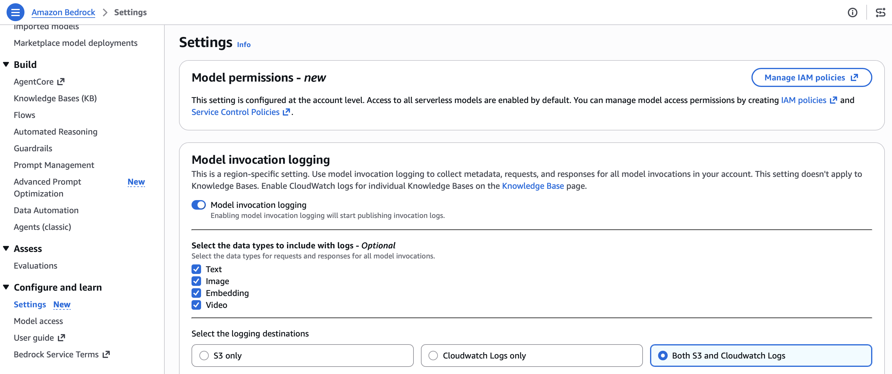
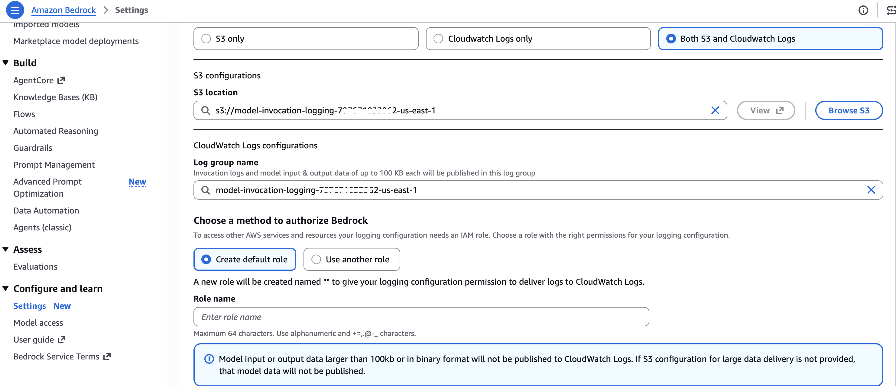
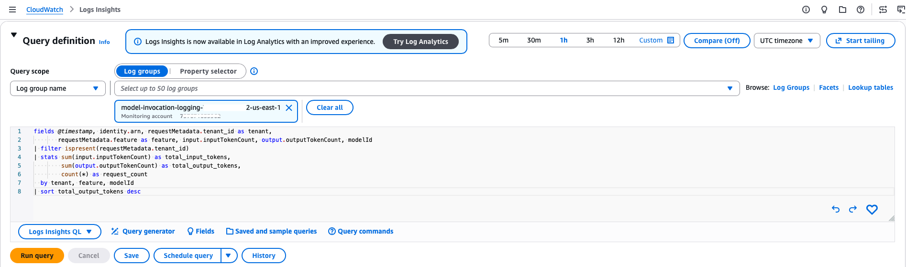
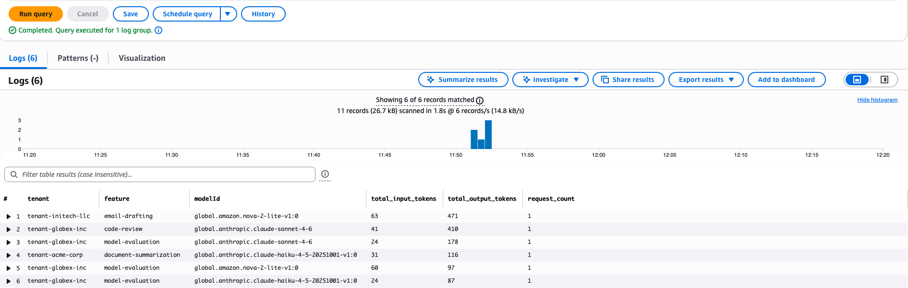
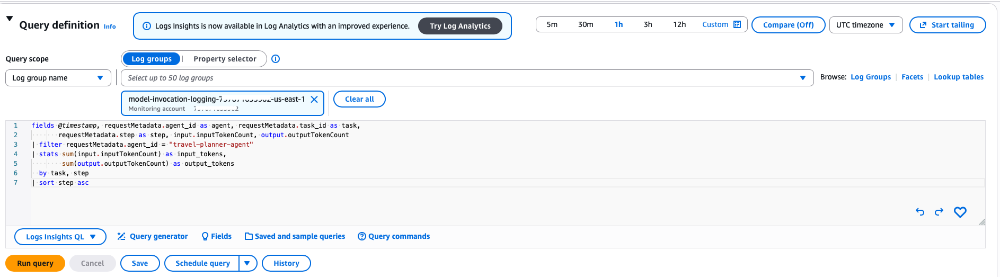
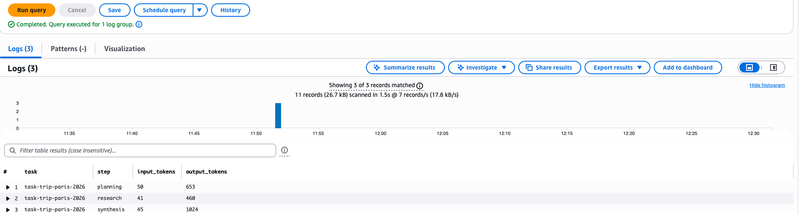

# Per-Request Metadata Tagging

Sample code for attaching metadata to individual inference calls and querying invocation logs for per-tenant, per-task cost attribution.

## Overview

Per-request metadata tagging gives you the finest-grained cost attribution. By attaching metadata key-value pairs to each API call, you can track costs down to individual tenants, features, or agent steps—without creating additional AWS resources. Unlike the other billing-based methods (which take ~24 hours to appear in Cost Explorer), metadata is available in invocation logs **near real-time**, within minutes of the call.

## Metadata Keys Used

| Key | Example Value | Purpose |
|-----|---------------|---------|
| `tenant_id` | `tenant-acme-corp` | Identify the tenant in a multi-tenant app |
| `feature` | `document-summarization` | Track which feature drives cost |
| `session_id` | `sess-a1b2c3d4` | Correlate costs to a user session |
| `agent_id` | `travel-planner-agent` | Identify the agent |
| `task_id` | `task-trip-paris-2026` | Group costs by agent task |
| `step` | `planning` | Track per-step cost in agentic workflows |
| `environment` | `production` | Separate dev/staging/prod usage |

Unlike the other methods, per-request metadata uses **custom keys** (no fixed prefix). The metadata appears in model invocation logs alongside token usage.

## How It Works

1. Enable model invocation logging in Amazon Bedrock
2. Add `requestMetadata` to Converse API and InvokeModel API calls
3. Metadata appears in model invocation logs alongside token usage
4. Query logs with Athena or visualize in QuickSight

## Important Note

This mechanism provides **token counts**, not dollar costs. You convert tokens to cost using the published pricing for each model.

## Best For

- Per-prompt, per-tenant, and per-experiment tracking on `bedrock-runtime`
- Multi-tenant applications needing tenant-level cost allocation
- AgentCore agent step-level attribution

## Prerequisites

- Python 3.12+
- IAM credentials with `bedrock-runtime:Converse` and `bedrock-runtime:InvokeModel` permissions
- Access to Claude and Nova models on Amazon Bedrock
- Dependencies installed via `pip install -r requirements.txt` from the repository root

> **Important:** Model invocation logging **must** be enabled in Amazon Bedrock settings before running this sample. Without logging enabled, the metadata you attach to requests will not be recorded anywhere. Enable it in the Bedrock console under **Settings > Model invocation logging**, choosing either CloudWatch Logs or S3 as the destination.

## Enabling Model Invocation Logging

Model invocation logging records every Bedrock API call (including input/output tokens, latency, and any attached metadata) to CloudWatch Logs, S3, or both. Without it enabled, per-request metadata has nowhere to land.

### What it captures

- Request and response metadata (including your custom `requestMetadata` fields)
- Token counts (input and output) per request
- Model ID, request ID, and timestamp
- Optionally, full request/response content (if you enable text and image logging)

### How to enable it

1. Open the [Amazon Bedrock console](https://console.aws.amazon.com/bedrock/)
2. In the left navigation, click **Settings** at the bottom
3. Under **Model invocation logging**, click **Edit**
4. Toggle logging **On**
5. Choose your log destination:
   - **CloudWatch Logs** - best for real-time queries with Logs Insights (recommended for this sample)
   - **S3** - best for long-term storage and Athena queries
   - **Both** - for real-time queries and archival
6. For CloudWatch Logs, select or create a log group (e.g., `/aws/bedrock/model-invocation-logs`)
7. Optionally enable **Text data** and **Image data** logging to capture full request/response content
8. Click **Save**





> **Note:** It may take a few minutes after enabling logging for the first log entries to appear. Once enabled, all subsequent Bedrock API calls in the region will be logged to your chosen destination.

## Querying Metadata in CloudWatch Logs Insights

After running the sample, you can query your model invocation logs in **CloudWatch Logs Insights** to aggregate token usage by tenant, feature, or agent task. Logs are available **near real-time** — you can run these queries within minutes of making inference calls. Run these queries against the log group configured in your Bedrock model invocation logging settings.

Example query — total tokens per tenant and feature:

```
fields @timestamp, identity.arn, requestMetadata.tenant_id as tenant,
       requestMetadata.feature as feature, input.inputTokenCount, output.outputTokenCount, modelId
| filter ispresent(requestMetadata.tenant_id)
| stats sum(input.inputTokenCount) as total_input_tokens,
        sum(output.outputTokenCount) as total_output_tokens,
        count(*) as request_count
  by tenant, feature, modelId
| sort total_output_tokens desc
```





Example query — per-task cost breakdown for an agent workflow:

```
fields @timestamp, requestMetadata.agent_id as agent, requestMetadata.task_id as task,
       requestMetadata.step as step, input.inputTokenCount, output.outputTokenCount
| filter requestMetadata.agent_id = "travel-planner-agent"
| stats sum(input.inputTokenCount) as input_tokens,
        sum(output.outputTokenCount) as output_tokens
  by task, step
| sort step asc
```




