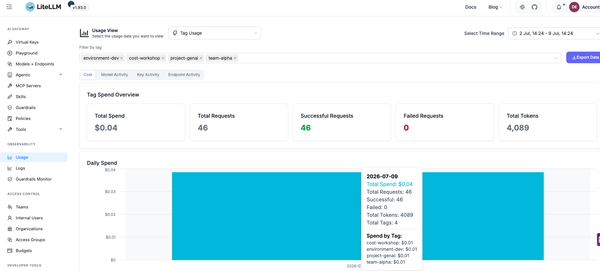
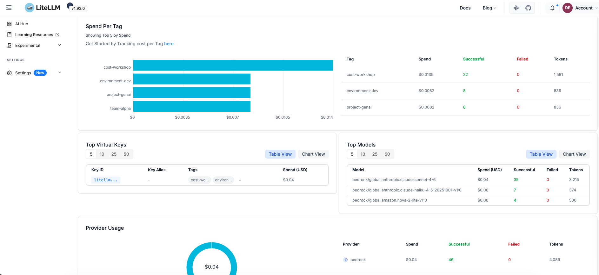
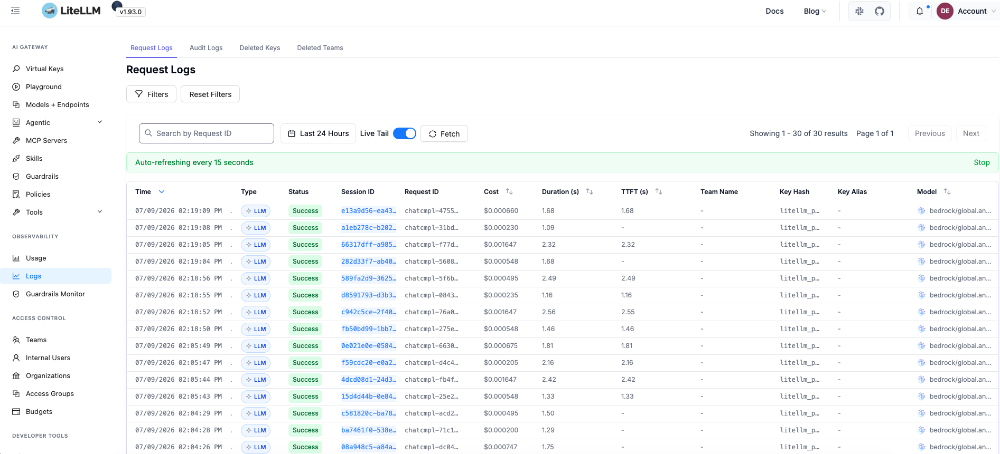
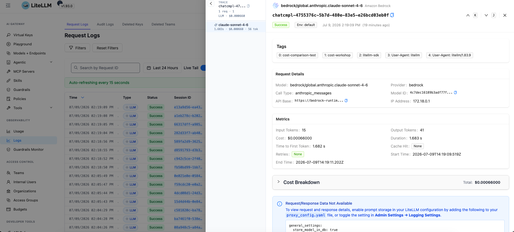

# LiteLLM

Sample code for using LiteLLM as a proxy gateway for real-time, multi-provider cost tracking.

## Overview

LiteLLM is an open-source LLM proxy that sits between your applications and model providers. It provides a unified API layer that routes requests to over 100 LLM providers (including Amazon Bedrock), with built-in real-time cost tracking, budget enforcement, and alerting.

## How It Works

1. Deploy LiteLLM as a proxy in front of your model providers
2. Configure routing rules and tagging (user, team, API key)
3. LiteLLM automatically tracks spend for every request in real time
4. Use the built-in dashboard for cost per user, team, API key, and model

## Important Caveat

Placing any proxy in front of Amazon Bedrock collapses the IAM identity—all calls appear under the proxy's IAM role unless the proxy assumes a per-user role or forwards request metadata. LiteLLM's cost figures are estimates based on published pricing; always reconcile against your AWS bill for invoice-accurate numbers.

## Best For

- Real-time cost visibility and budget enforcement
- Multi-provider environments needing a single pane of glass
- Organizations that need immediate spend alerts rather than next-day billing data

## Prerequisites

- Docker and Docker Compose
- AWS credentials (IAM role-based). The LiteLLM container needs AWS credentials passed as environment variables since it can't access your host's IAM role directly.
- Amazon Bedrock model access enabled for the models listed in `config.yaml`

## Setup

1. Navigate to the LiteLLM sample folder:

```bash
cd samples/6-litellm
```

2. Create a `.env` file with your AWS credentials:

```bash
cp .env.example .env
```

Then populate `.env` with your credentials. If you're using IAM Identity Center (SSO):

```bash
# Export temporary credentials from your active SSO session
aws configure export-credentials --format env-no-export > .env
```

Or manually set them:

```
AWS_ACCESS_KEY_ID=<your-key>
AWS_SECRET_ACCESS_KEY=<your-secret>
AWS_SESSION_TOKEN=<your-token>
```

3. Start the services:

```bash
docker compose up -d
```

This starts:
- **PostgreSQL** on port 5432 (stores spend data, teams, keys)
- **LiteLLM Proxy** on port 4000

> **Note**: Allow about a minute for the services to fully initialize before sending requests.

4. Verify everything is running:

```bash
docker compose ps
```

## Configuration

The `config.yaml` defines three Bedrock models using cross-region inference profiles:

| Alias | Bedrock Model ID |
|-------|-----------------|
| `nova-2-lite` | `global.amazon.nova-2-lite-v1:0` |
| `claude-sonnet-4-6` | `global.anthropic.claude-sonnet-4-6` |
| `claude-haiku-4-5` | `global.anthropic.claude-haiku-4-5-20251001-v1:0` |

## Quick test with curl

```bash
curl http://localhost:4000/litellm/v1/chat/completions \
  -H "Authorization: Bearer sk-1234" \
  -H "Content-Type: application/json" \
  -H "x-litellm-tags: curl-test,cost-workshop" \
  -d '{
    "model": "claude-haiku-4-5",
    "messages": [{"role": "user", "content": "Hello! What is generative AI?"}]
  }'
```

Once running:
- **Proxy API**: http://localhost:4000/litellm
- **Admin UI**: http://localhost:4000/litellm/ui (login with username `admin` and master key `sk-1234`)

## Request Tags for Spend Attribution

LiteLLM uses **request tags** to track spend by custom labels (team, project, environment, SDK type, etc.). Tags are passed via the `x-litellm-tags` header as a comma-separated string and appear in the **Tags** section of each request trace in the UI.

Example tags used in this sample:
- `openai-sdk` / `litellm-sdk` — identifies which SDK made the request
- `cost-workshop` — groups all workshop requests together
- `team-alpha` — team attribution
- `project-genai` — project attribution
- `environment-dev` — environment label

You can view spend aggregated by tag in the UI under **Usage** or via the API:

```bash
curl "http://localhost:4000/litellm/spend/tags?start_date=2026-07-01&end_date=2026-07-31" \
  -H "Authorization: Bearer sk-1234"
```

## Testing the Proxy

### Option 1: OpenAI SDK (`01_litellm_proxy_openai_sdk.py`)

Uses the standard OpenAI Python SDK — familiar interface, tags passed via `x-litellm-tags` header:

```bash
python 01_litellm_proxy_openai_sdk.py
```

```python
from openai import OpenAI

client = OpenAI(api_key="sk-1234", base_url="http://localhost:4000/litellm/v1")

response = client.chat.completions.create(
    model="claude-haiku-4-5",
    messages=[{"role": "user", "content": "Hello! What is generative AI?"}],
    extra_headers={
        "x-litellm-tags": "openai-sdk,cost-workshop,team-alpha"
    }
)
print(response.choices[0].message.content)
```

### Option 2: LiteLLM SDK (`02_litellm_proxy_litellm_sdk.py`)

Adds cost-management features: per-request cost estimates, token counting, model cost comparison, and tags:

```bash
python 02_litellm_proxy_litellm_sdk.py
```

```python
import litellm

litellm.api_base = "http://localhost:4000/litellm"
litellm.api_key = "sk-1234"

response = litellm.completion(
    model="claude-haiku-4-5",
    messages=[{"role": "user", "content": "Hello! What is generative AI?"}],
    extra_headers={
        "x-litellm-tags": "litellm-sdk,cost-workshop,team-alpha"
    }
)
print(response.choices[0].message.content)
cost = litellm.completion_cost(completion_response=response)
print(f"Estimated Cost: ${cost:.6f}")
```

### LiteLLM SDK advantages for cost management

| Feature | OpenAI SDK | LiteLLM SDK |
|---------|-----------|-------------|
| Call the proxy | ✅ | ✅ |
| Built-in `completion_cost` per request | ❌ | ✅ |
| Token counting before sending | ❌ | ✅ |
| Client-side fallbacks between models | ❌ | ✅ |
| Switch providers with one string change | ❌ | ✅ |
| Request tags via header | ✅ | ✅ |

## Viewing Cost Data

Once the proxy is running and you've sent a few requests:

1. Open http://localhost:4000/litellm/ui
2. Log in with username `admin` and master key (`sk-1234`)
3. Navigate to the **Usage** tab to see per-model and per-tag spend estimates

Spend data is persisted in PostgreSQL across restarts.

### Tag Usage

View how many requests were made with each tag:



### Spend Per Tag

See cost breakdown grouped by your custom tags (team, project, environment):



### Request Logs

Browse individual request logs with full details:



### Log Record Detail

Drill into a single log record to see tokens, cost, model, and metadata:



## Stopping the Services

```bash
docker compose down
```

To also remove the database volume (deletes all spend history):

```bash
docker compose down -v
```

> **Note**: This sample uses Docker Compose with a local PostgreSQL instance for simplicity. LiteLLM requires PostgreSQL for the UI dashboard and spend tracking features. For a full scalable solution, refer to the [Guidance for Multi-Provider Generative AI Gateway on AWS](https://github.com/aws-solutions-library-samples/guidance-for-multi-provider-generative-ai-gateway-on-aws).
